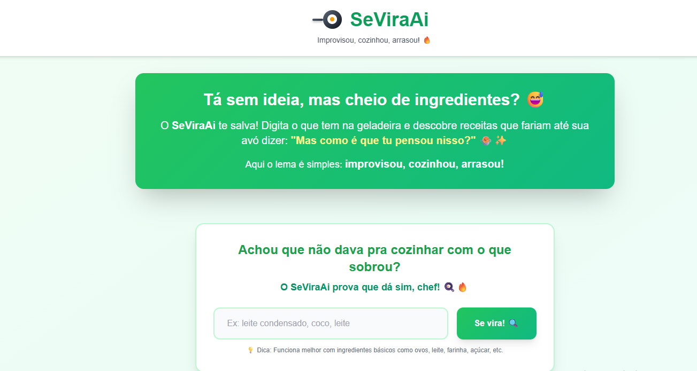
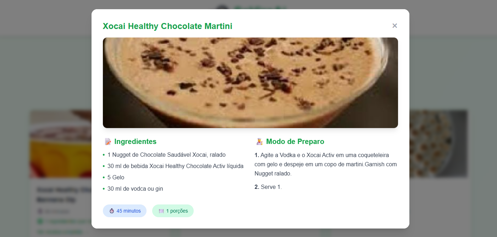

# 🍳 SeViraAi - Receitas Criativas

> **Improvisou, cozinhou, arrasou!** 🔥

## 📖 Sobre o Projeto

O **SeViraAi** é uma aplicação web que ajuda você a descobrir receitas incríveis usando os ingredientes que você tem em casa. Acabou aquela desculpa de "não tenho nada pra comer" - digite o que tem na geladeira e deixe a mágica acontecer!






### ✨ Características

- 🔍 **Busca inteligente**: Encontra receitas baseadas nos seus ingredientes
- 🌍 **Tradução automática**: Todas as receitas traduzidas para português
- 📱 **Design responsivo**: Funciona perfeitamente em celular, tablet e desktop
- 🎨 **Interface moderna**: Design clean e intuitivo com animações suaves
- ⚡ **Rápido e eficiente**: Resultados instantâneos com API confiável

## 🚀 Como Usar

1. **Digite os ingredientes** que você tem disponível (ex: "leite condensado, coco, leite")
2. **Clique em "Se vira!"** ou pressione Enter
3. **Navegue pelos resultados** e clique na receita que mais te interessar
4. **Veja os detalhes completos** com ingredientes e modo de preparo traduzidos automaticamente

### 💡 Dicas para Melhores Resultados

- Use ingredientes básicos e comuns (leite, ovos, farinha, açúcar, etc.)
- Separe os ingredientes por vírgula
- Não precisa colocar quantidades, apenas os nomes
- Quanto menos ingredientes, mais resultados você encontra

## 🛠️ Tecnologias Utilizadas

- **HTML5** - Estrutura semântica
- **CSS3** - Estilização moderna com Tailwind CSS
- **JavaScript** (Vanilla) - Lógica da aplicação
- **Spoonacular API** - Base de dados de receitas
- **MyMemory Translation API** - Tradução automática

## 📋 Funcionalidades

### Busca de Receitas
- Busca por ingredientes em português
- Tradução automática dos termos para inglês
- Ordenação por ingredientes disponíveis
- Até 12 resultados por busca

### Detalhes da Receita
- Imagem em alta qualidade
- Lista completa de ingredientes (traduzida)
- Modo de preparo passo a passo (traduzido)
- Tempo de preparo
- Número de porções

### Interface
- Cards interativos com hover effects
- Modal responsivo para detalhes
- Estados de loading animados
- Feedback visual em todas as ações
- Tema verde vibrante e acolhedor

## 🔑 APIs Utilizadas

### Spoonacular API
- **Endpoint de Busca**: `/recipes/complexSearch`
- **Endpoint de Detalhes**: `/recipes/{id}/information`
- Requer API key (gratuita com limitações)

### MyMemory Translation API
- Tradução gratuita
- Limite de 500 caracteres por requisição
- Sistema de chunking implementado para textos longos

## 📦 Estrutura do Projeto

```
Se Vira Ai/
│
├── index.html          # Arquivo principal da aplicação
├── style.css           # Estilos CSS/
├── script.js           # Lógica JavaScript
├── README.md           # Este arquivo
│
└── Recursos externos:
    ├── Tailwind CSS (CDN)
    ├── Google Fonts (Poppins)
    ├── Spoonacular API
    └── MyMemory Translation API
```

## 🎯 Recursos Principais

### Tradução de Ingredientes
O sistema possui um dicionário interno com os ingredientes mais comuns em português, garantindo buscas precisas mesmo quando você digita em PT-BR.

### Tradução Automática de Conteúdo
- Ingredientes e instruções são traduzidos automaticamente
- Sistema de chunking para textos longos
- Fallback para conteúdo original em caso de erro
- Loading states durante a tradução

### Responsividade
- Layout adaptável para mobile, tablet e desktop
- Grid responsivo que se ajusta ao tamanho da tela
- Modal otimizado para todas as resoluções

## 🔧 Configuração

### Para usar localmente:

1. Clone ou baixe o arquivo `index.html`
2. Abra o arquivo em qualquer navegador moderno
3. Não é necessário servidor - funciona offline (exceto pelas APIs)

### Para obter sua própria API key:

1. Acesse [Spoonacular](https://spoonacular.com/food-api)
2. Crie uma conta gratuita
3. Gere sua API key
4. Substitua a chave no código (variável `API_CONFIG.apiKey`)

## ⚠️ Limitações

- A API gratuita do Spoonacular tem limite de requisições por dia
- A tradução pode ter pequenas imprecisões em termos técnicos
- Algumas receitas podem não ter todos os campos preenchidos
- Requer conexão com internet para funcionar

## 🎨 Personalização

### Cores
O tema atual usa verde como cor principal. Para mudar:
- Procure por classes do Tailwind como `green-*`, `emerald-*`
- Ajuste os gradientes nas classes `.hero-gradient` e `.text-gradient`

### Fonte
Atualmente usa **Poppins** do Google Fonts. Para mudar, edite a importação no `<style>`.

## 📱 Compatibilidade

- ✅ Chrome (recomendado)
- ✅ Firefox
- ✅ Safari
- ✅ Edge
- ✅ Navegadores móveis modernos

## 🤝 Contribuindo

Sugestões e melhorias são sempre bem-vindas! Sinta-se à vontade para:
- Reportar bugs
- Sugerir novas funcionalidades
- Melhorar a tradução de ingredientes
- Aprimorar o design

## 👩‍💻 Autora

**Danielly Pedrini**

- GitHub: [Danielly Pedrini](https://github.com/danielly-pedrini)
- LinkedIn: [[Danielly Pedrini](https://www.linkedin.com/in/daniellypedrini/)]

---

**Lembre-se**: Na cozinha, como na vida, o importante é se virar! 🍲✨

*"Tá sem ideia, mas cheio de ingredientes? SeViraAi te salva!"*

---

Desenvolvido com ❤️ e muita criatividade para facilitar a vida de quem ama cozinhar (ou improvisa na cozinha)!
